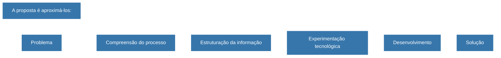

## MATHEUS CÂNDIDO VIEIRA

### Gestão · Tecnologia · Inovação

  <strong>Administrador</strong> • <strong>Gestão Pública</strong> • <strong>Gestão em Saúde</strong> • <strong>Desenvolvimento de Sistemas</strong>

  
    
  

 

---

## Sobre mim

Minha trajetória começou na **Administração** e se desenvolveu principalmente no campo da **gestão pública**, aproximando-se progressivamente de tecnologia, processos e inovação.

Meu interesse está justamente nessa interseção:

> **compreender problemas de gestão e utilizar tecnologia como ferramenta para estruturar, automatizar e construir novas possibilidades de solução.**

---

## O que estouconstruindo

Não vejo este perfil apenas como um espaço para armazenar códigos.

Ele funciona como um **laboratório de experimentação.**

Aqui registro projetos, estudos e experiências relacionados a:

  
  
  
  
  
  
  

---

## Projeto em destaque

### Auto-Atas-DOWeb

**Automação para busca, processamento, classificação e consolidação de Atas de Registro de Preços.**

O projeto nasceu de um problema concreto de gestão e tornou-se uma experiência prática de desenvolvimento de uma ferramenta capaz de integrar:

**processo → dados → automação → classificação → informação**

---

## Tecnologia como experimentação

Minha formação principal está relacionada à gestão.

A formação técnica em **Desenvolvimento de Sistemas**, por outro lado, representa uma oportunidade de explorar uma área que sempre despertou meu interesse: a tecnologia.

Não tenho como objetivo separar esses conhecimentos em dois caminhos independentes.

## Stack de experimentação

> A tecnologia é, para mim, menos um fim e mais uma ferramenta para experimentar novas formas de resolver problemas.

---

## Trajetória em construção  

<strong>Formação</strong>

 

**Administração**  
Universidade Estácio de Sá · 2019–2023

**Gestão de Projetos de TI e Metodologias Ágeis**  
IBMR · 2024

**Gestão da Qualidade**  
Universidade Candido Mendes · 2023–2025

**Gestão em Saúde**  
UESPI · em andamento

**Gestão Pública**  
UNIFAL/MG · em andamento

**Desenvolvimento de Sistemas**  
IFSULDEMINAS · em andamento

<strong>Interesses</strong>

 

- Administração Pública
- Gestão Pública
- Saúde Pública
- Gestão de contratações
- Transformação digital
- Tecnologia aplicada ao setor público
- Gestão da informação
- Automação de processos
- Inovação

---

## Onde gestão encontra tecnologia

| Gestão | Tecnologia |
|:---:|:---:|
| Processos | Sistemas |
| Governança | Automação |
| Organização | Dados |
| Qualidade | Desenvolvimento |
| Saúde Pública | Transformação Digital |

O ponto de interesse está justamente **entre essas duas áreas**

É nessa interseção que pretendo desenvolver novos projetos e experimentos.

---

 

  
Matheus Cândido Vieira · Rio de Janeiro, Brasil

[def]: ttps://github-readme-stats.vercel.app/api?username=Mth7z&show_icons=true&hide_border=true&title_color=3776AB&icon_color=3776AB&text_color=4B5563&bg_color=FFFFF
